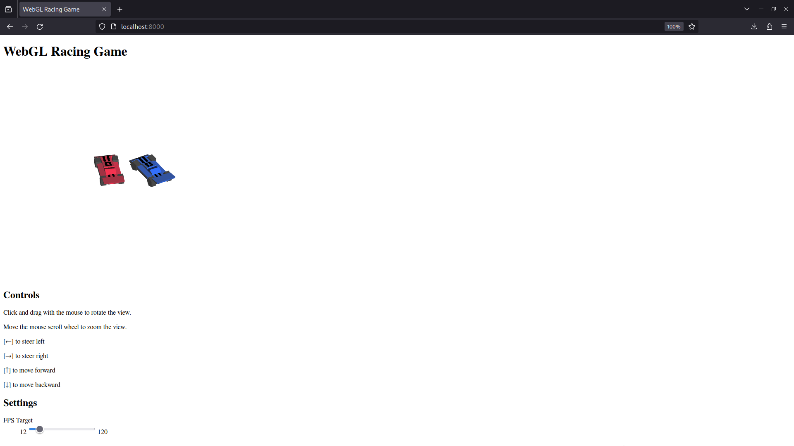

WebGL Race Game
===
Hardware-acellerated 3D racing game for the web browser
---
This is a very simple racing game made with HTML/CSS/JavaScript, WebGL, and GLSL.

### Installation Guide
* [Install git](https://github.com/git-guides/install-git).
* [Clone this repository](https://docs.github.com/en/repositories/creating-and-managing-repositories/cloning-a-repository#cloning-a-repository) to a directory on your computer. That directory will be referred to as `root`.

### Run Guide
Run any server in the `root` directory to serve `index.html`. The easiest way I know of to do this is with Python:
* [Install Python 3](https://realpython.com/installing-python/) and ensure it's referencable by PATH.
* Open a terminal in the root folder.
* Run `python -m http.server 8000` in the terminal.
* Navigate to [localhost:8000](http://localhost:8000) in a web browser.

